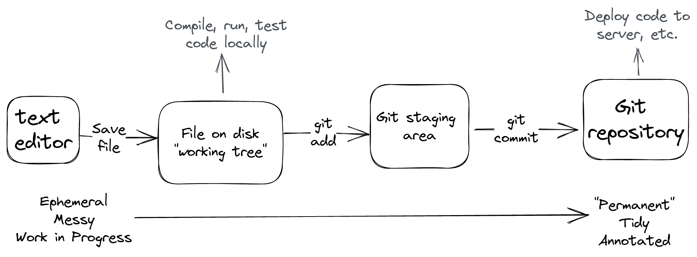

# Git Workshop: Recording Changes

## Exercise: Tell Git Who You Are

```shell
git config --global user.name "cmart"
git config --global user.email "email@cmart.today"
```

---

## Exercise: Create a File with some Contents

From within an empty repo directory:

```shell
$ echo "Hello world, this is my project" > readme.md
$ cat readme.md
Hello world, this is my project
$ git status
```

<!--
Git will show an untracked file

You'll notice we're working with text, not source code. This simplifies the session a bit. Git sees no fundamental difference between source and plain text. It works the same with code.
-->

---

## About Commits

**Vocabulary:** a *commit* is a specific record of changes to one or more files. A *commit message* describes the changes.

A Git repository stores a series of commits.

A commit also contains:
- Author
- Timestamp
- 0, 1, or 2 parent commits
- Cryptographic hash of entire history
- Etc

<!--
How do we get to a commit?
-->

---

## Flow of Changes



<!--
Recording our changes with Git is a multiple-step process. Save the file, then add changes to staging area, then commit those changes.

Each step to the right is an opportunity to tidy, structure, and annotate your work.

This can be loopy: you can continue editing and saving at any time.
-->

---

## More Vocabulary

The *working tree* is the directory (tree) of files stored locally on disk, where you _work_ on changes.

The *staging area* is where you move a set of changes that you're about to commit.


<!--
When you save a file in your code editor, your changes are in the working tree.
-->

---

## Exercise: Add to Staging Area

```shell
$ git add readme.md
$ git status
```

<!--
Git will show an untracked file
-->

---

## Exercise: Commit your Changes

```shell
$ git commit -m "Adding readme file"
$ git status
```

<!--
You'll see your first commit!
-->

---

## Exercise: `git diff` to view Unstaged, Staged, and Committed changes

Save some changes to a file:

```shell
$ echo "Here is another line in the readme file" >> readme.md
$ cat readme.md
Hello world, this is my project
Here is another line in the readme file
$ git diff
```

Add changes to staging area:

```shell
$ git add readme.md
$ git diff
$ git diff --staged
```

Then commit again:

```shell
$ git commit -m "Adding more content to readme"
$ git diff
$ git status
```

<!--
Remember you can run `git status` at any time for an overview of what's going on.
-->

---

## Review: Staging area

The staging area _de-couples_ changes to the working tree  from what we choose to include/exclude in the next commit.

This allows you to be sloppy with saving files, while still producing neat commits!