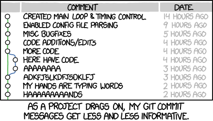

# Git Workshop: Studying History

## Exercise: Looking at Commit Log

```shell
$ git log
commit 88ff0fd3aefe48835e8b7c14ee6bea57ecb4bb12 (HEAD -> master)
Author: chris <chris@c-mart.in>
Date:   Fri May 12 16:42:02 2023 -0700

    Adding more content to readme

commit eae604e167fded504b8f552ba7e736381487ccc5
Author: chris <chris@c-mart.in>
Date:   Fri May 12 16:37:33 2023 -0700

    adding readme file
```

<!--
What is that long string of hexadecimal characters after the word "commit"?
It's a commit hash. It serves multiple purposes.

"HEAD" means the most recent commit.

"master" is a branch, you might see "main" or "trunk", means the same thing. Branches are a way to track different versions of history.
-->

---

## Commit Hash

```
88ff0fd3aefe48835e8b7c14ee6bea57ecb4bb12
```

Serves multiple purposes:

- Identifier to look up a commit
  - Like a street address for a house
- Cryptographic checksum of entire repo history leading to that commit
  - This is a blockchain technology!

Don't try to type these. Copy and paste.

<!--
Using a hash as a lookup is called _content addressing_, or content-addressable storage
-->

---

## Exercise: Inspecting a Particular Commit

Identify a commit by its hash!

```shell
$ git show eae604e167fded504b8f552ba7e736381487ccc5
commit eae604e167fded504b8f552ba7e736381487ccc5 (HEAD -> master)
Author: chris <chris@c-mart.in>
Date:   Fri May 12 16:37:33 2023 -0700

    adding readme file

diff --git a/readme.md b/readme.md
new file mode 100644
index 0000000..0c094b1
--- /dev/null
+++ b/readme.md
@@ -0,0 +1 @@
+Hello world, this is my project
```

<!--
Don't bother trying to type a commit hash, just copy and paste it.

Another purpose of commit hash: cryptographic verification of entire history of repository up to that commit. Similar to a blockchain in this way!
-->

---

## What Makes a Good Commit Message?



([XKCD #1296](https://xkcd.com/1296/))

<!--

-->

---

- First line is a _concise_ description of the change
- Optional subsequent lines can include background information

<!--
First line doesn't need to be a complete sentence. Imagine a caption underneath a photograph in an album. It doesn't say "This is a picture of Billy jumping in the pool"

A commit message can be multiple lines of text.
-->

---

## What Makes a Good Commit Scope?

- One logical change, e.g.:
  - Adding a button to a web page
  - Fixing one bug
  - Making the same tweak across multiple files

The contents of a commit should be small enough so that it's easy for another human reviewer to understand what the change is about.

Have some empathy for your colleagues and your future self.

Large changes deserve multiple commits!

<!--
This is _not_ the same habit as "I've made a lot of changes, time to save my file".

It's more like, "I've made a lot of changes and saved my file. Let's structure these as a series of commits that make sense."
-->

---

## Recap

- Git rewards disciplined and thoughtful use
- You are writing the history of your project in a way that tells a logical story
- But don't worry much about this when you're just learning!

---

## Real-world Example

Series of commits to implement a feature change in Exosphere:

<https://gitlab.com/exosphere/exosphere/-/merge_requests/796/commits>
