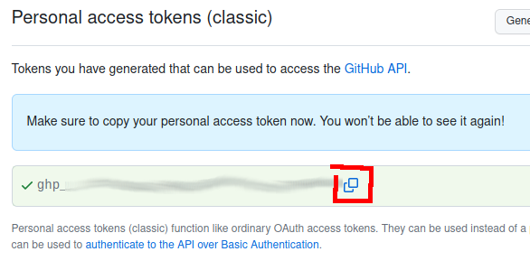
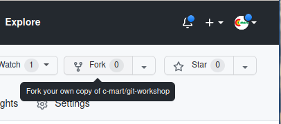
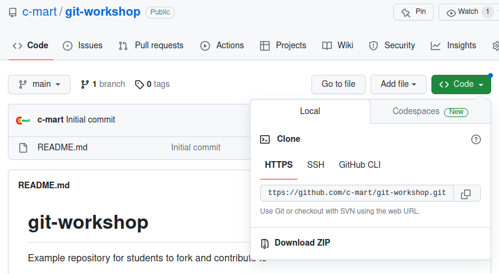

# Git Workshop: Working with Servers

Goals:
- Create your own copy of someone else's project
- Make changes and upload your changes to GitHub

## Exercise: Create a GitHub Personal Access Token

You will need this to authenticate to GitHub via the CLI.

- Log into GitHub
- Browse to <https://github.com/settings/tokens/new>
- Type something in the "Note" field, e.g. "ACCESS STEP"
- **Check the "repo" box**
- Scroll to the bottom, click "Generate token"
- Copy the token text out of the green box
- Paste it somewhere _safe and private_ (like your password manager or a local text editor)



<!--
There is another way to authenticate to GitHub from the CLI, using an SSH keypair. We aren't covering it today but it's a good option to use.
-->

---

## Exercise: Fork a Repository on GitHub

**Vocabulary:** a _fork_ (in this case) is a copy of a repository, in a different GitHub account than the original repo author.

- Browse to <https://github.com/c-mart/git-workshop>
- Click the "fork" button



<!--
When making a contribution to someone else's software project, it's common to fork the repo, make the changes to your fork, then request that the project _pull_ those changes. This is a _pull request_, we'll get there in a few minutes! 
-->

---

## Exercise: Clone Your Fork Repo

Who remembers what it means to _clone_ a repository?



---

Back in the terminal:

```shell
git clone https://github.com/your-github-username/git-workshop
```

<!--
Please ensure the URL contains your own GitHub username, not `cmart`
-->

---

## Exercise: Make a New File and Commit It

Practice of something we've done already!

```shell
$ echo "my favorite animal is ..." > your-name-here.md
$ git add your-name-here.md
$ git commit -m "Adding a file for my favorite animal"
```

<!--
Please name the file something unique.

Remember that you're saving a file, adding it to the staging area, then making a commit.
-->

---

## Exercise: Push Commit to Your Fork Repo on GitLab

**Vocabulary:** to _push_ a repo means to send new changes to a remote server. (In this case, the remote server is GitHub.)

```shell
$ git push
Username for 'https://github.com': your-github-username
Password for 'https://c-mart@github.com': 
```

- For password, use the personal access token you created earlier
- Then browse to <https://github.com/your-git-username/git-workshop>
- If you see your committed new file, congratulations!