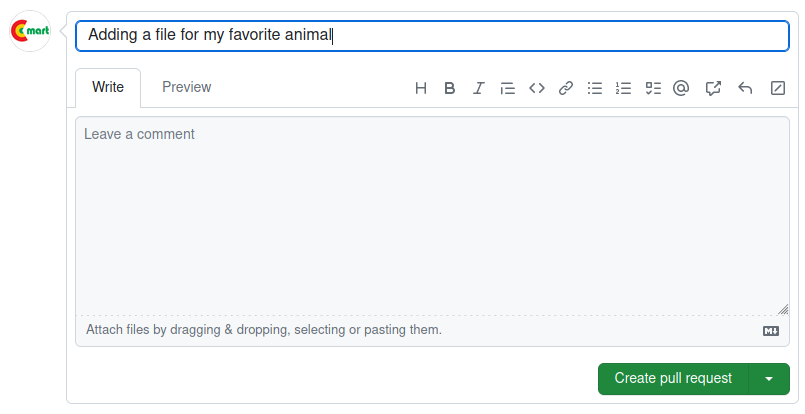

# Git Workshop: Contributing to a Software Project

- We just pushed changes to our fork of someone's software project. 
- Now we'll request that the project's author incorporate our changes.

**Vocabulary:** a _pull request_ (PR) is a proposal to add changes (commits) to a software project.

<!--
In this case, the author happens to be me.

On GitLab this is called a _merge request_, it's the exact same thing.

Usually, but not always, the person who _submits_ the PR is different from the person who _merges_ the PR.
-->

---

## Exercise: Create Pull Request

<!--
Can someone volunteer to share their screen for this one? It's hard to show for my own project.
-->

- Go to <https://github.com/c-mart/git-workshop/compare/>
- Base repository should be `c-mart/git-workshop`
- Head repository should be `your-github-username/git-workshop`
- `main` branch in both cases
- Create pull request

Then I will see your PR and merge it!